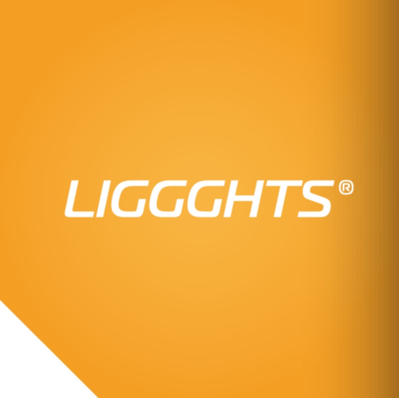
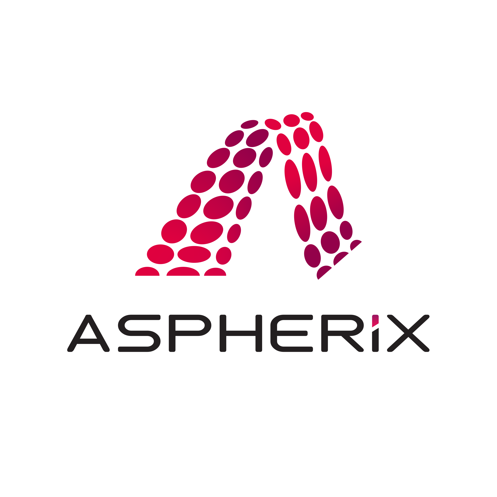

<div align ="center">
<p float="left">
  
   
</p>

</div>

## Aspherix® is the successor of LIGGGHTS®

Aspherix® is available under commercial license and combines DCS’s learnings from the development of LIGGGHTS® and a large set of new, cutting edge features. For more information, please visit https://www.aspherix-dem.com/.

Cronology of the development:
* LAMMPS: core development by Sandia Corporation since 2003
* LIGGGHTS® core development by DCS Computing GmbH and JKU Linz since 2009
* Aspherix®: core development by DCS Computing GmbH since 2019

</div>

## LIGGGHTS®-PUBLIC

**LIGGGHTS®-PUBLIC** is an Open Source Discrete Element Method Particle Simulation Software, distributed by DCS Computing GmbH, Linz, Austria.
LIGGGHTS® is a registered trade marks of DCS Computing GmbH, the producer of the LIGGGHTS® software; see http://www.cfdem.com/terms-trademark-policy for details.

</div>

LIGGGHTS®-PUBLIC is open-source, distributed under the terms of the GNU Public License, version 2 or later. LIGGGHTS®-PUBLIC is part of CFDEM(R)project: www.liggghts.com | www.cfdem.com
Core developer and main author: Christoph Kloss, christoph.kloss@dcs-computing.com

## LIGGGHTS® version information
All LIGGGHTS® versions are based on a specific version of LIGGGHTS®, as printed in the file src/version.h. LIGGGHTS® versions are identidied by a version number (e.g. ‘3.0’), a branch name (which is ‘LIGGGHTS®-PUBLIC’ for your release of LIGGGHTS), compilation info (date / time stamp and user name), and a LAMMPS version number (which is the LAMMPS version that the LIGGGHTS®-PUBLIC release is based on). The LAMMPS “version” is the date when it was released, such as 1 May 2010.

</div>

If you browse the HTML doc pages on the LIGGGHTS®-PUBLIC website (https://www.cfdem.com/media/DEM/docu/Manual.html), they always describe the most current version of LIGGGHTS®-PUBLIC. If you browse the HTML doc pages included in your tarball, they describe the version you have.

## LIGGGHTS® and its ancestor LAMMPS
Some parts of LIGGGHTS® are based on LAMMPS. LAMMPS stands for Large-scale Atomic/Molecular Massively Parallel Simulator. 
LAMMPS is Copyright (2003) Sandia Corporation.  Under the terms of Contract DE-AC04-94AL85000 with Sandia Corporation, the U.S. Government retains certain rights in this software.  This software is distributed under the GNU General Public License. 

</div>

LAMMPS is a classical molecular dynamics simulation code designed to run efficiently on parallel computers. It was developed at Sandia National Laboratories, a US Department of Energy facility, with funding from the DOE.  It is an open-source code, distributed freely under the terms of the GNU Public License (GPL).

</div>

The primary author of LAMMPS is Steve Plimpton, who can be emailed at sjplimp@sandia.gov.  The LAMMPS WWW Site at lammps.sandia.gov has more information about the code and its uses.

## Structure
The LIGGGHTS® distribution includes the following files and directories:

* `README`: this file
* `LICENSE`: the GNU General Public License (GPL)
* `doc`: documentation
* `examples`: simple example simulation setups
* `lib`: libraries LIGGGHTS® can be linked with
* `python`: Python wrapper on LIGGGHTS® as a library
* `src`: source files

Point your browser at any of these files to get started:

* `doc/Manual.html`: the manual
* `doc/Section_intro.html`: hi-level introduction
* `doc/Section_start.html`: how to build and use

## Copyrights
* Copyright 2012-now: DCS Computing GmbH, Linz
* Copyright 2009-2015: JKU Linz
Some parts of LIGGGHTS® are based on LAMMPS and Copyright on these
parts is held by Sandia Corporation and other parties. Info on LAMMPS below
Some parts of LIGGGHTS® are contributied by other parties, which are
holding the Copyright. This is listed in each file of the distribution.

## How to cite LIGGGHTS®
If you are using PhasicFlow in your research or industrial work, cite the following [article](https://www.researchgate.net/profile/Stefan-Pirker/publication/264439676_Models_algorithms_and_validation_for_opensource_DEM_and_CFD-DEM/links/56af5af108ae28588c62fd16/Models-algorithms-and-validation-for-opensource-DEM-and-CFD-DEM.pdf):
```
@article{kloss2012models,
  title={Models, algorithms and validation for opensource DEM and CFD--DEM},
  author={Kloss, Christoph and Goniva, Christoph and Hager, Alice and Amberger, Stefan and Pirker, Stefan},
  journal={Progress in Computational Fluid Dynamics, an International Journal},
  volume={12},
  number={2-3},
  pages={140--152},
  year={2012},
  publisher={Inderscience Publishers}
}
```
