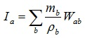

[LIGGGHTS(R)-TUG WWW Site](http://www.cfdem.com),
[LIGGGHTS(R)-TUG Commands](Section_commands.html#comm)

fix sph/integrity  command
===============
* * *
Syntax
---------------------

```
fix ID group-ID style args

```

* ID, group-ID are documented in [fix](fix.html) command
* style = sph/integrity
* args = list of arguments

> _every_ value = nSteps
>> nSteps = calculation frequency in time steps (optional)

* * *
Examples
---------------------
```
fix integ all sph/integrity
fix integ all sph/integrity every 200
```

* * *
LIGGGHTS(R)-TUG vs. LIGGGHTS(R)-TUG Info
---------------------
This command is not available in LIGGGHTS(R)-TUG.

* * *
Description
---------------------
This fix calculates the discrete approximation of the volume integral of the
smoothing kernel for each SPH particle, also known as the SPH interpolant of 1.
Theoretically, this yields a value of 1 due to the normalization condition of
the kernel function. Only at the boundaries, the value is significantly lower
due to missing neighbor particles (i.e., the integral is not complete).
Thus, this value indicates the completeness of the neighbor particles and
for simplicity it is called 'integrity' here. It is commonly used for
normalization purposes at the boundaries and is calculated according to
(see, e.g., [Randles and Libersky (1996)](#RandlesLibersky1996)):



* * *
Restart, fix_modify, output, run start/stop, minimize info
---------------------
No information is written to [binary restart files](restart.html).
None of the [fix_modify](fix_modify.html) options are relevant for this fix.
No parameter of this fix can be used with the start/stop keywords of the
[run](run.html) command. This fix is not invoked during
[energy minimization](minimize.html).

This fix generates a fix property/atom with the ID 'int', where the calculated
values of the integrity are stored.

* * *
Restrictions
---------------------
none

* * *
Related commands
---------------------
[fix wall/sph/general/gap](fix_wall_sph_general_gap.md)

* * *
Default
---------------------
nSteps = 1

<a name="RandlesLibersky1996"/>
**(Randles and Libersky, 1996)** P.W. Randles, L.D. Libersky,
Smoothed Particle Hydrodynamics: Some recent improvements and applications,
Comput. Methods Appl. Eng. 139 (1996) 375-408.
