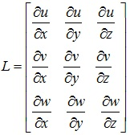
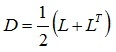
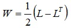
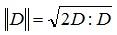
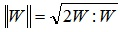
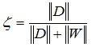

[LIGGGHTS(R)-TUG WWW Site](http://www.cfdem.com),
[LIGGGHTS(R)-TUG Commands](Section_commands.html#comm)

fix sph/mixidx  command
===============
* * *
Syntax
---------------------

```
fix ID group-ID style args

```

* ID, group-ID are documented in [fix](fix.html) command
* style = sph/mixidx
* args = list of arguments

> _every_ value = nSteps
>> nSteps = calculation frequency in time steps (optional)

* * *
Examples
---------------------
```
fix mix all sph/mixidx
fix mix all sph/mixidx every 200
```

* * *
LIGGGHTS(R)-TUG vs. LIGGGHTS(R)-TUG Info
---------------------
This command is not available in LIGGGHTS(R)-TUG.

* * *
Description
---------------------
This fix calculates a scalar which quantifies the elongational
and rotational flow components, as shown by e.g.,
[Yang and Manas-Zloczower (1992)](#YangManasZloczower1992).
Since this local type of flow is crucial for mixing, this quantity
is sometimes called 'mixing index'. The calculation is based on
the velocity gradient tensor L (where u, v and w are the velocity
components):



From L, the rate-of-strain tensor D and the vorticity tensor W are
calculated:





Using these, the magnitudes of D and W are calculated by:





Finally, ||D|| and ||W|| yield the mixing index &#950;:



The values of &#950; are between 0 and 1, specifically the value 0 is obtained
for a rigid body rotation, 0.5 for a 2D Couette flow
and 1 for an elongational flow.

* * *
Restart, fix_modify, output, run start/stop, minimize info
---------------------
No information is written to [binary restart files](restart.html).
None of the [fix_modify](fix_modify.html) options are relevant for this fix.
No parameter of this fix can be used with the start/stop keywords of the
[run](run.html) command. This fix is not invoked during
[energy minimization](minimize.html).

This fix generates the following fixes:

* fix property/atom with the ID 'gamma', where the values of ||D|| are stored.

* fix property/atom with the ID 'omega', where the values of ||W|| are stored.

* fix property/atom with the ID 'mixidx', where the values of &#950; are stored.

* * *
Restrictions
---------------------
Requires a [fix sph/velgrad](fix_sph_velgrad.md).

* * *
Related commands
---------------------
[fix sph/velgrad](fix_sph_velgrad.md).

* * *
Default
---------------------
nSteps = 1

* * *
<a name="YangManasZloczower1992"/>
**(Yang and Manas-Zloczower, 1992)** H.-H. Yang, I. Manas-Zloczower,
Flow Field Analysis of the Kneading Disc Region in a Co-Rotating
Twin Screw Extruder, Polymer Engineering and Science 32 (1992), 19, 1411-1417.
