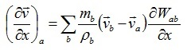

[LIGGGHTS(R)-TUG WWW Site](http://www.cfdem.com),
[LIGGGHTS(R)-TUG Commands](Section_commands.html#comm)

fix sph/velgrad  command
===============
* * *
Syntax
---------------------

```
fix ID group-ID style args

```

* ID, group-ID are documented in [fix](fix.html) command
* style = sph/velgrad
* args = list of arguments

> _every_ value = nSteps
>> nSteps = calculation frequency in time steps (optional)

* * *
Examples
---------------------
```
fix vgrad all sph/velgrad
fix vgrad all sph/velgrad every 200
```

* * *
LIGGGHTS(R)-TUG vs. LIGGGHTS(R)-TUG Info
---------------------
This command is not available in LIGGGHTS(R)-TUG.

* * *
Description
---------------------
Calculates the SPH velocity gradients for particle 'a' according to:



For the y and z derivatives the calculation is analogous.

* * *
Restart, fix_modify, output, run start/stop, minimize info
---------------------
No information is written to [binary restart files](restart.html).
None of the [fix_modify](fix_modify.html) options are relevant for this fix.
No parameter of this fix can be used with the start/stop keywords of the
[run](run.html) command. This fix is not invoked during
[energy minimization](minimize.html).

This fix generates three fix property/atom with the IDs 'dvdx', 'dvdy' and
'dvdz', where the calculated velocity gradients are stored. Each of them
includes three components, e.g., dvdx includes the x-derivatives of the
velocity components u, v and w: dvdx[0] = du/dx, dvdx[1] = dv/dx,
dvdx[2] = dw/dx. Analogous, dvdy and dvdz include the y and z-derivatives
of the velocity components.

* * *
Restrictions
---------------------
none

* * *
Related commands
---------------------
[fix sph/mixidx](fix_sph_mixidx.md)

* * *
Default
---------------------
nSteps = 1
