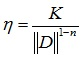
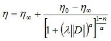
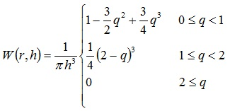
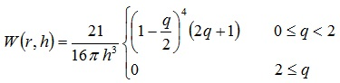
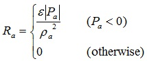

[LIGGGHTS(R)-TUG WWW Site](http://www.cfdem.com),
[LIGGGHTS(R)-TUG Commands](Section_commands.html#comm)

pair_style sph/morris/tensCorr command
===============
* * *
Syntax
---------------------

```
pair_style sph/morris/tensCorr kernelstyle args keyword values

```

* sph/morris/tensCorr = name of this pair_style command
* kernelstyle = _cubicspline_ or _wendland_
* args = list of arguments for a particular style

> _cubicspline_ or _wendland_ args = h
>> h = smoothing length

* zero or more keyword/value pairs may be appended to args
* keyword = _newton_ or _power_ or _carreau_ and/or _tensCorr_

> _newton_ values = eta
>> eta = dynamic viscosity

> _power_ values = K n etamax etamin
>> K = consistency index
>> n = power law index
>> etamax = maximum viscosity
>> etamin = minimum viscosity

> _carreau_ values = eta0 etainf lambda a n
>> eta0 = viscosity at zero shear rate
>> etainf = viscosity at infinite shear rate
>> lambda = time constant (inverse critical shear rate)
>> a = exponent
>> n = power law index

> _tensCorr_ values = epsilon deltap
>> epsilon = coefficient of the tensile correction
>> deltap = initial particle distance

* * *
Examples
---------------------
```
pair_style sph/morris/tensCorr wendland 0.001 newton 0.5
pair_style sph/morris/tensCorr cubicspline 0.001 newton 0.5 tensCorr 0.2 5e-4
pair_style sph/morris/tensCorr cubicspline 0.001 power 3 0.6 10 0 tensCorr 0.2 5e-4
pair_style sph/morris/tensCorr cubicspline 0.001 carreau 0.5 0 0.1 2 0.6 tensCorr 0.2 5e-4
```

* * *
LIGGGHTS(R)-TUG vs. LIGGGHTS(R)-TUG Info
---------------------
This command is not available in LIGGGHTS(R)-TUG.

* * *
Description
---------------------
The _sph/morris/tensCorr_ style is based on the smoothed particle hydrodynamics
(SPH) method according to [Monaghan (2000)](#Monaghan2000), while the viscous
forces are calculated via the model of [Morris et al. (1997)](#Morris1997)
instead of the artificial viscosity model:


Here, the index a denotes the considered particle, index b denotes the
neighbors of a, m is the particle mass, P the pressure and &#961; the density.
The term R(f<sub>ab</sub>)<sup>n</sup> represents the tensile correction,
W the kernel (which is defined by the kernelstyle), &#951; the dynamic
viscosity of the fluid, r<sub>ab</sub> the distance between the centers of
a and b and v<sub>ab</sub> the relative velocity.

With the keyword _newton_, the viscosity of a Newtonian fluid is used, i.e.,
&#951; has a constant value specified by the argument eta.

With the keyword _power_, the viscosity &#951; is calculated by the power law,
using the consistency index K and the power law index n:



For the local shear rate the magnitude of the rate-of-strain tensor ||D|| is
used. The calculation of ||D|| is the same as described in
[fix sph/mixidx](fix_sph_mixidx.md). For n = 1 the power law yields a Newtonian
fluid, n < 1 yields a pseudoplastic fluid (shear-thinning) and n > 1 a dilatant
fluid (shear-thickening). The arguments etamin and etamax are used as lower and
upper limits for the viscosity values (to avoid extremely low or high viscosity
values which could cause instabilities).

With the keyword _carreau_, the viscosity &#951; is calculated by the Carreau
model:



where the arguments eta0, etainf, lamda, a and n specify the values of the
parameters. The viscosity at infinite shear rate is often set to zero. The exponent
a is often 2 for Carreau fluids. With 1 - n = a, the Cross model can be obtained.

For kernelstyle cubicspline a piecewise defined, 3rd order kernel is used, which
is defined in 3D as (q is the distance from the center relative to the smoothing
length q = r/h):



The wendland kernel ([Wendland, 1995](#Wendland1995)) is defined in 3D as:



The smoothing length h is the most important parameter in SPH and is related to
the spatial resolution, i.e., the particle distances. A typical value is 1.2
times the initial particle distance on a 3D cubic lattice
(see [Monaghan, 2005](#Monaghan2005), [Liu and Liu, 2003](#LiuLiu2003)).
This yields approximately 57 particles within a sphere of radius 2h.

The atom style _sph/var_ uses the input argument h as initial smoothing length
for all particles. In case the atom style _sph_ is used, an additional per-type
property sl must be defined for the smoothing length, e.g.,

```
fix           m2 all property/global sl peratomtype 0.0012
```

By appending the keyword _tensCorr_ the tensile correction
R(f<sub>ab</sub>)<sup>n</sup> according to [Monaghan (2000)](#Monaghan2000)
is enabled, which avoids unphysical clustering of particles when negative
pressure values occur. The factor R is related to the pressure and can be
calculated by R = R<sub>a</sub> + R<sub>b</sub>. R<sub>a</sub> is calculated by



R<sub>b</sub> is calculated analogously. A typical value for _epsilon_ is 0.2.
f<sub>ab</sub> is calculated by


where &Delta;p denotes the initial particle spacing. Further details about the
applied SPH method are given in [Eitzlmayr et al. (2014)](#Eitzlmayr2014).


* * *
Mixing, shift, table, tail correction, restart, rRESPA info
---------------------

The [pair_modify](pair_modify.html) mix, shift, table, and tail options
are not relevant for sph pair styles.

These pair styles write their information to [binary restart
files](restart.html), so a pair_style command does not need to be
specified in an input script that reads a restart file.

These pair styles can only be used via the _pair_ keyword of the
[run_style respa](run_style.html) command.  They do not support the
_inner_, _middle_, _outer_ keywords.

* * *
Restrictions
---------------------
none

* * *
Related commands
---------------------
[pair_coeff](pair_coeff.html)

* * *
Default
---------------------
none

* * *
<a name="Eitzlmayr2014"/>
**(Eitzlmayr et al., 2014)** A. Eitzlmayr, G. Koscher, J. Khinast,
A novel method for modeling of complex wall geometries in SPH.
Comp. Phys. Comm. 185 (2014) 2436-2448.

<a name="LiuLiu2003"/>
**(Liu and Liu, 2003)** G.R. Liu, M.B. Liu, Smoothed Particle Hydrodynamics:
A Meshfree Particle Method,
World Scientific Publishing Co. Pte. Ltd., Singapore, 2003.

<a name="Monaghan2000"/>
**(Monaghan, 2000)** J.J. Monaghan, SPH without a Tensile Instability,
J. Comput. Phys. 159 (2000) 290-311.

<a name="Monaghan2005"/>
**(Monaghan, 2005)** J.J. Monaghan, Smoothed particle hydrodynamics,
Rep. Prog. Phys. 68 (2005) 1703-1759.

<a name="Morris1997"/>
**(Morris et al., 1997)** J.P. Morris, P.J. Fox, Y. Zhu,
Modeling Low Reynolds Number Incompressible Flows Using SPH,
J. Comput. Phys. 136 (1997) 214-226.

<a name="Wendland1995"/>
**(Wendland, 1995)** H. Wendland, Piecewise polynomial, positive definite
and compactly supported radial functions of minimal degree,
Adv. Comput. Math. 4 (1995) 1, 389-396.

